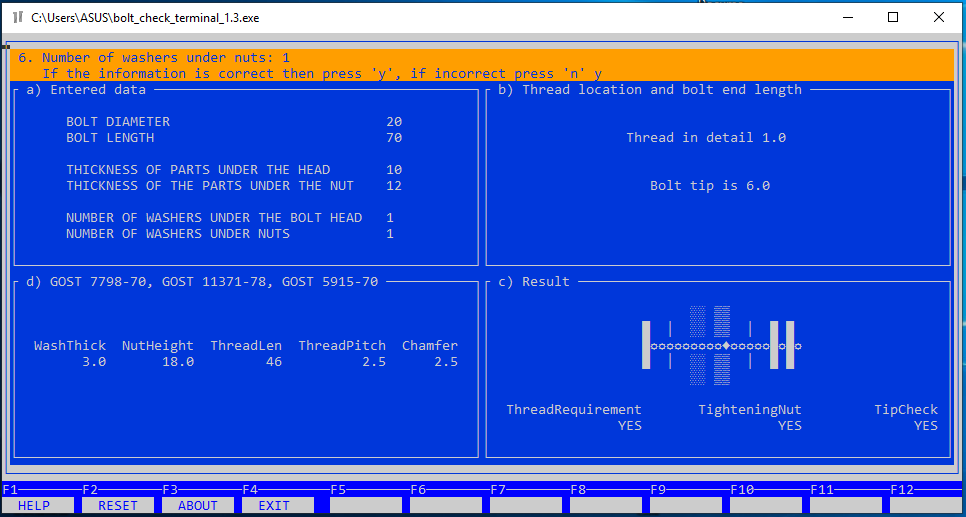

# Многомодульная программа 
### Консольное приложение "Проверка длины болта в соединениях без контролируемого натяжения"

Разработка является продолжением развития консольного приложения, которое вы можете посмотреть по ссылке:

[проверка длины болта в соединениях без контролируемого натяжения](https://github.com/muraviev-aa/Pro.Engineer.C.BoltLengthCheck?tab=readme-ov-file#%D0%BC%D0%BD%D0%BE%D0%B3%D0%BE%D0%BC%D0%BE%D0%B4%D1%83%D0%BB%D1%8C%D0%BD%D0%B0%D1%8F-%D0%BF%D1%80%D0%BE%D0%B3%D1%80%D0%B0%D0%BC%D0%BC%D0%B0)

Данное приложение имеет текстовый интерфейс пользователя. Такая возможность, при разработке в Windows, предоставляется библиотекой управления терминалом **curses.h**.

#### Файл для тестирования работы приложения:

* 7798.csv

(<a href="#readme-top">вверх</a>)
